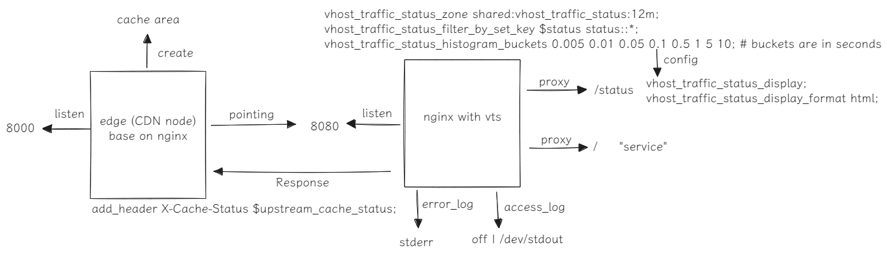
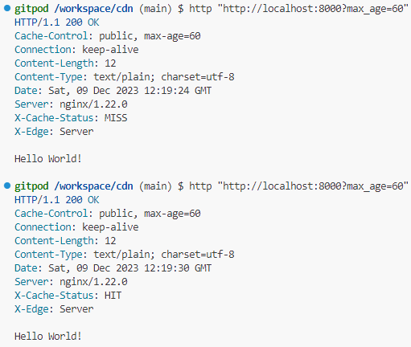

# CDN

## Thanks

[Github: cdn-up-and-running](https://github.com/leandromoreira/cdn-up-and-running)

[Github: docker-nginx-vts](https://github.com/mordaha/docker-nginx-vts)

## Architecture



## Step

### Build backend server & Run 

```shell
cd server

docker build -t cdn-server .
```

### Build CDN node

```shell
cd edge

docker build -t cdn-edge .
```

### Run CDN node and backend server node

```shell
docker network create cdn-network

docker run --name backend -p 8080:80 --network cdn-network cdn-server

docker run --name edge -p 8000:80 --network cdn-network cdn-edge

# or
docker compose up
```

### Result

